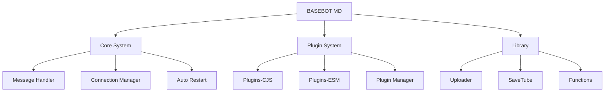

<div align="center">
  
</div>

<p align="center">
  
</p>

<div align="center">
  
  [](https://github.com/nhebotx-md/basebot)
  [](LICENSE)
  [](https://nodejs.org/)
  [](https://github.com/itsukichan/baileys)
  
</div>

<div align="center">
  
  [](https://github.com/nhebotx-md/basebot/stargazers)
  [](https://github.com/nhebotx-md/basebot/network)
  [](https://github.com/nhebotx-md/basebot/issues)
  [](https://github.com/nhebotx-md/basebot/commits/main)
  
</div>

---

## 🚀 Quick Start

```bash
# Clone repository
git clone https://github.com/nhebotx-md/basebot.git
cd basebot

# Install dependencies
npm install

# Start bot
npm start
```

---

## 📋 Table of Contents

- [✨ Features](#-features)
- [🛠️ Installation](#️-installation)
  - [Termux](#termux-android)
  - [Windows](#windows)
  - [Linux/VPS](#linuxvps)
- [⚙️ Configuration](#️-configuration)
- [📁 Folder Structure](#-folder-structure)
- [🔌 Plugin System](#-plugin-system)
- [📝 Commands](#-commands)
- [📚 Documentation](#-documentation)
- [🤝 Contributing](#-contributing)
- [📄 License](#-license)

---

## ✨ Features

<div align="center">

| Feature | Status | Description |
|---------|--------|-------------|
| 🔐 **Pairing Code** | ✅ | Login tanpa QR Code |
| 🔘 **Button Support** | ✅ | Tombol interaktif WhatsApp |
| 📱 **iOS/Android** | ✅ | Support semua platform |
| 🔌 **Dual Plugin** | ✅ | CJS + ESM support |
| 🎵 **YouTube Downloader** | ✅ | MP3 download |
| 🔍 **Search Engine** | ✅ | Pinterest & Spotify |
| 💾 **Auto Backup** | ✅ | Backup otomatis |
| ⚡ **Auto Restart** | ✅ | Restart otomatis |
| 🛡️ **Anti Call** | ✅ | Blokir panggilan |
| 👋 **Welcome/Goodbye** | ✅ | Pesan otomatis |

</div>

### 🎯 Core Features



---

## 🛠️ Installation

### Termux (Android)

> **⚠️ Requirements**: Android 7.0+ | RAM 3GB+ | Storage 1GB+

```bash
# Update & upgrade packages
pkg update && pkg upgrade -y

# Install required packages
pkg install git nodejs ffmpeg libwebp -y

# Clone repository
git clone https://github.com/nhebotx-md/basebot.git

# Masuk ke folder
cd basebot

# Install dependencies
npm install

# Jalankan bot
npm start
```

<details>
<summary>🔧 <b>Troubleshooting Termux</b></summary>

#### Error: `Cannot find module`
```bash
# Clear cache dan reinstall
rm -rf node_modules package-lock.json
npm cache clean --force
npm install
```

#### Error: `Permission denied`
```bash
# Beri izin eksekusi
chmod +x main.js
termux-setup-storage
```

#### Error: `Session expired`
```bash
# Hapus session lama
rm -rf session
npm start
```

</details>

---

### Windows

> **⚠️ Requirements**: Windows 10/11 | Node.js 18+ | Git

```powershell
# Install Node.js dari https://nodejs.org/
# Install Git dari https://git-scm.com/

# Clone repository
git clone https://github.com/nhebotx-md/basebot.git

# Masuk ke folder
cd basebot

# Install dependencies
npm install

# Jalankan bot
npm start
```

---

### Linux/VPS

> **⚠️ Requirements**: Ubuntu 20.04+ | Node.js 18+ | 2GB RAM

```bash
# Update system
sudo apt update && sudo apt upgrade -y

# Install Node.js 18.x
curl -fsSL https://deb.nodesource.com/setup_18.x | sudo -E bash -
sudo apt install -y nodejs

# Install dependencies
sudo apt install -y git ffmpeg libwebp-dev

# Clone repository
git clone https://github.com/nhebotx-md/basebot.git

# Masuk ke folder
cd basebot

# Install dependencies
npm install

# Jalankan dengan PM2 (untuk VPS)
sudo npm install -g pm2
pm2 start main.js --name "basebot"
pm2 save
pm2 startup
```

---

## ⚙️ Configuration

### 🔧 Edit `config.js`

```javascript
global.owner = ['62881027174423']      // Nomor owner
global.namaown = "TangxAja"             // Nama owner
global.prefa = ['','!','.',',','🐤','🗿']  // Prefix commands
global.thumbnail = "https://your-image.jpg"  // Thumbnail bot

// Fitur Welcome/Goodbye
global.welcome = true
global.goodbye = true

// Pesan error
global.mess = {
  owner: "Maaf hanya untuk owner bot",
  prem: "Maaf hanya untuk pengguna premium",
  admin: "Maaf hanya untuk admin group",
  botadmin: "Maaf bot harus dijadikan admin",
  group: "Maaf hanya dapat digunakan di dalam group",
  private: "Silahkan gunakan fitur di private chat",
}
```

---

## 📁 Folder Structure

```
basebot/
├── 📂 Library/                 # Library & utilities
│   ├── handle.mjs             # ESM handler
│   ├── handler.js             # CJS handler
│   ├── myfunction.js          # Helper functions
│   ├── participants.js        # Group participants
│   ├── savetube.js            # YouTube downloader
│   ├── system.js              # Case system manager
│   └── uploader.js            # File uploader
│
├── 📂 Plugins-CJS/            # CommonJS plugins
│   ├── plugin-add.js          # Add plugin command
│   ├── plugin-del.js          # Delete plugin command
│   ├── plugin-get.js          # Get plugin command
│   └── plugin-list.js         # List plugins command
│
├── 📂 Plugins-ESM/            # ESM plugins
│   ├── _pluginmanager.mjs     # Plugin manager
│   ├── download-ytmp3.mjs     # YouTube MP3
│   ├── owner-backup.mjs       # Backup system
│   ├── search-pinterest.mjs   # Pinterest search
│   └── search-spotifyplay.mjs # Spotify search
│
├── 📂 System/                 # Core system
│   └── message.js             # Message utilities
│
├── 📂 data/                   # Data storage
│   ├── owner.json             # Owner data
│   └── premium.json           # Premium users
│
├── 📄 WhosTANG.js             # Main case handler
├── 📄 config.js               # Configuration
├── 📄 main.js                 # Entry point
├── 📄 package.json            # Dependencies
└── 📄 .gitignore              # Git ignore
```

---

## 🔌 Plugin System

### 📝 Membuat Plugin CJS

```javascript
// Plugins-CJS/hello.js
module.exports = {
  name: 'hello',
  command: ['hello', 'hi'],
  category: 'general',
  description: 'Say hello',
  async execute(sock, m, args) {
    await sock.sendMessage(m.chat, { text: 'Hello! 👋' }, { quoted: m })
  }
}
```

### 📝 Membuat Plugin ESM

```javascript
// Plugins-ESM/hello.mjs
async function handler(m, { sock }) {
  await sock.sendMessage(m.chat, { text: 'Hello! 👋' }, { quoted: m })
}

handler.help = ['hello']
handler.tags = ['general']
handler.command = /^(hello|hi)$/i

export default handler
```

### 🛠️ Plugin Manager Commands

| Command | Description |
|---------|-------------|
| `.pluginadd <name>` | Tambah plugin baru |
| `.plugindel <name>` | Hapus plugin |
| `.pluginget <name>` | Lihat isi plugin |
| `.pluginlist` | Daftar semua plugin |

---

## 📝 Commands

### 📥 Downloader

| Command | Description | Example |
|---------|-------------|---------|
| `.ytmp3 <url>` | Download YouTube MP3 | `.ytmp3 https://youtu.be/xxx` |

### 🔍 Search

| Command | Description | Example |
|---------|-------------|---------|
| `.pinterest <query>` | Search Pinterest | `.pinterest anime` |
| `.spotify <query>` | Search Spotify | `.spotify naruto` |

### 👑 Owner

| Command | Description |
|---------|-------------|
| `.backup` | Backup session & data |

---

## 📚 Documentation

Untuk dokumentasi lengkap, silakan kunjungi:

📖 **[Dokumentasi Lengkap](./DOCS.md)**

### 📖 Topics Covered

- [Getting Started](./DOCS.md#getting-started)
- [Configuration Guide](./DOCS.md#configuration)
- [Plugin Development](./DOCS.md#plugin-development)
- [API Reference](./DOCS.md#api-reference)
- [Troubleshooting](./DOCS.md#troubleshooting)
- [FAQ](./DOCS.md#faq)

---

## 🛡️ Security Features

```javascript
// Anti-call otomatis
WhosTANG.ev.on('call', async (caller) => {
    console.log("📞 CALL BLOCKED");
    // Bot akan menolak panggilan otomatis
});

// Session encryption
const { state, saveCreds } = await useMultiFileAuthState("./session");

// Auto reconnect
if (lastDisconnect.error.output.statusCode !== DisconnectReason.loggedOut) {
    connectToWhatsApp();
}
```

---

## 🎨 Customization

### 🖼️ Thumbnail

```javascript
// Ganti thumbnail di config.js
global.thumbnail = "https://your-image-url.jpg"
```

### 🎭 Custom Welcome Message

```javascript
// Edit di config.js
global.welcomeMessage = (name, group) => {
  return `👋 Selamat datang *${name}* di *${group}*!`
}
```

---

## 🤝 Contributing

Kontribusi selalu diterima! Ikuti langkah berikut:

```bash
# Fork repository
# Clone fork Anda
git clone https://github.com/YOUR_USERNAME/basebot.git

# Buat branch baru
git checkout -b feature/nama-fitur

# Commit perubahan
git commit -m "Add: nama fitur"

# Push ke branch
git push origin feature/nama-fitur

# Buat Pull Request
```

### 📋 Contribution Guidelines

- ✅ Gunakan commit message yang jelas
- ✅ Tambahkan dokumentasi untuk fitur baru
- ✅ Pastikan kode tidak ada error
- ✅ Ikuti style guide yang ada

---

## 📊 Stats

<div align="center">
  
  
  
  
  
</div>

---

## 🙏 Credits

<div align="center">

| Library | Author | Link |
|---------|--------|------|
| @itsukichan/baileys | Itsukichan | [GitHub](https://github.com/itsukichan/baileys) |
| socketon | Socketon | [NPM](https://www.npmjs.com/package/socketon) |
| axios | Axios Team | [GitHub](https://github.com/axios/axios) |
| yt-search | TimeForANinja | [GitHub](https://github.com/TimeForANinja/node-ytsr) |

</div>

---

## 📞 Support

<div align="center">

[](https://wa.me/62881027174423)
[](https://t.me/tangxaja)
[](https://github.com/nhebotx-md)

</div>

---

## 📄 License

<div align="center">

This project is licensed under the **MIT License** - see the [LICENSE](LICENSE) file for details.

[](LICENSE)

</div>

---

<div align="center">
  
</div>

<p align="center">
  <b>Made with ❤️ by <a href="https://github.com/nhebotx-md">TangxAja</a></b>
</p>

<p align="center">
  
</p>
